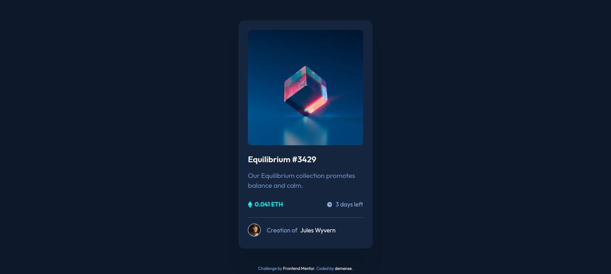

# Frontend Mentor - NFT preview card component solution

This is a solution to the [NFT preview card component challenge on Frontend Mentor](https://www.frontendmentor.io/challenges/nft-preview-card-component-SbdUL_w0U). Frontend Mentor challenges help you improve your coding skills by building realistic projects. 

### Screenshot



### Links

- Live Site URL: https://demense.github.io/nft-preview-card-component/

### Built with

- Semantic HTML5 markup
- CSS custom properties
- Flexbox

### What I learned

CSS image overlay
```css
.main-image {
    width: 303px;
    height: 303px;
    border-radius: 10px;
    margin-bottom: 23px;
    opacity: 1;
    display: block;
    transition: .5s ease;
    backface-visibility: hidden;
}

.middle {
    transition: .5s ease;
    opacity: 0;
    position: absolute;
    top: 154px;
    left: 50%;
    transform: translate(-50%, -50%);
    -ms-transform: translate(-50%, -50%)
  }

  .background {
    position: absolute;
    top: 0%;
    left: 0%;
    width: 303px;
    height: 303px;
    border-radius: 10px;
    background-color: hsl(178, 100%, 50%);
    opacity: 0;
  }
  
  .image-container:hover .middle {
    opacity: 1;
  }

  .image-container:hover .background {
    opacity: 0.5;
  }
```

# My account on Frontend Mentor

[@demense](https://www.frontendmentor.io/profile/demense)